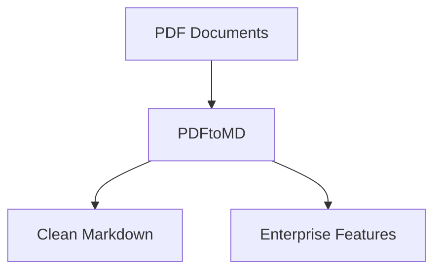
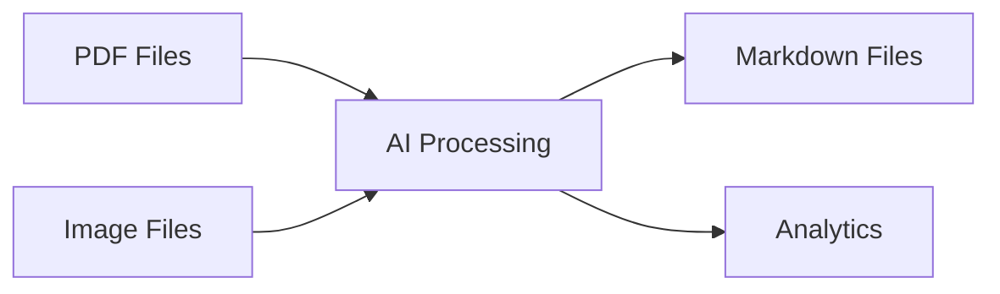
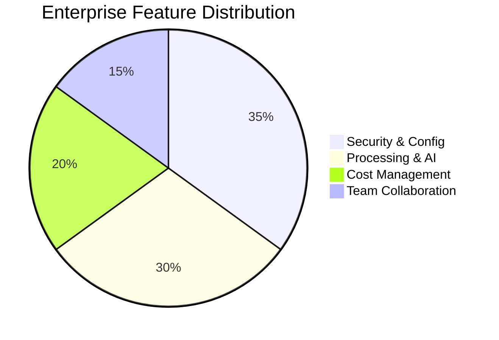
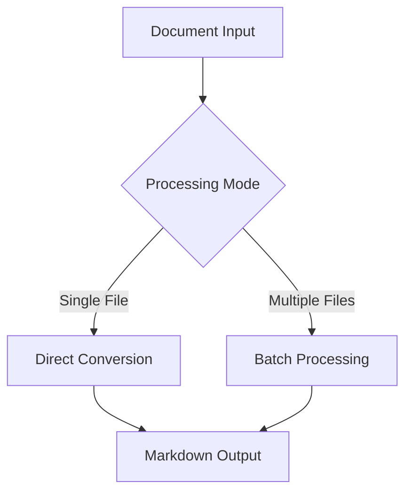
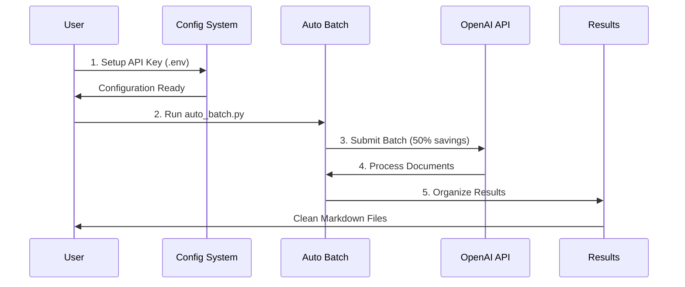
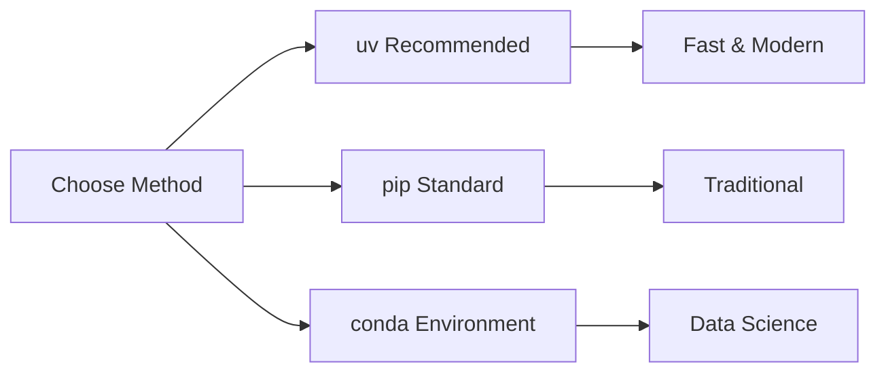
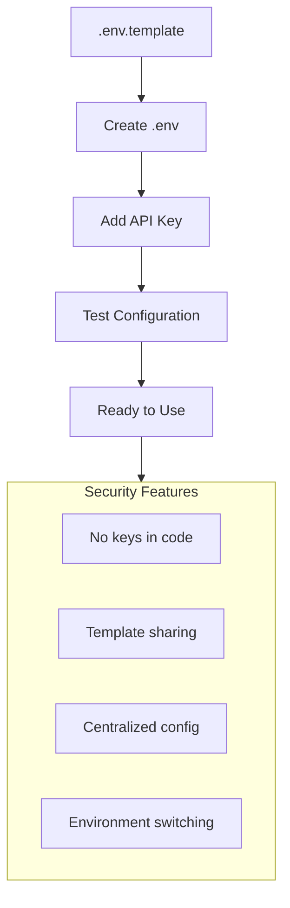
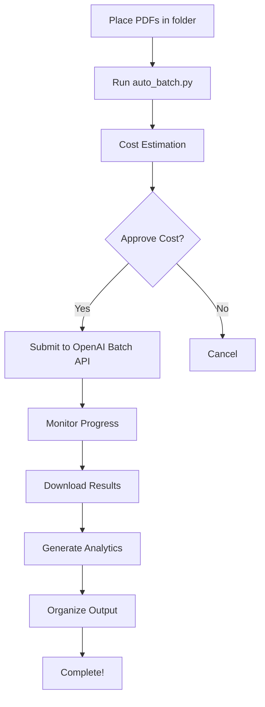
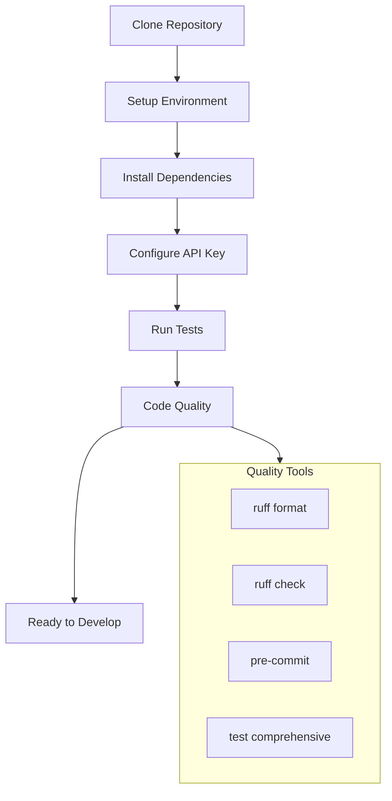
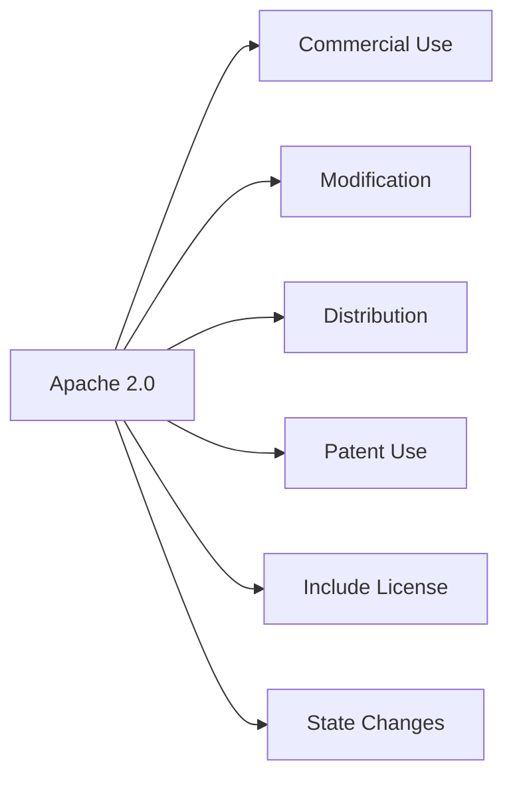

# PDFtoMD

Enterprise-ready PDF to Markdown conversion tool powered by multimodal AI. Features secure SSOT configuration, centralized API key management, comprehensive security controls, and enterprise-grade batch processing capabilities.

## 🏗️ Architecture Overview

## Overview

PDFtoMD is designed to simplify the process of converting PDF documents into clean, editable Markdown text for enterprise environments. By utilizing advanced multimodal AI models with enterprise-grade security and configuration management, it can accurately extract text, preserve formatting, and handle complex document structures including tables, formulas, and diagrams.

## Enterprise Features

| Feature | Description | Benefits |
|---|---|---|
| 🔧 **SSOT Configuration** | Centralized configuration management | Secure, consistent settings across deployments |
| 🔒 **Security Framework** | Enterprise-grade security controls | API key protection, audit trails, compliance |
| 👥 **Team Collaboration** | Multi-user support with secure onboarding | Scalable team workflows, role management |
| 📊 **Cost Management** | Advanced analytics and budget controls | Predictable costs, usage optimization |
| ⚙️ **Production Architecture** | Robust error handling and monitoring | High availability, enterprise reliability |
| 🧪 **Comprehensive Testing** | 100% test coverage with CI/CD | Quality assurance, automated validation |

## 🚀 Quick Installation

### Git Installation (Recommended)

`bash

# Clone repository

git clone https://github.com/ch0t4nk/PDFtoMD.git
cd PDFtoMD

# Setup virtual environment

python -m venv PDFtoMD-env

# Windows:

PDFtoMD-env\Scripts\activate

# macOS/Linux:

source PDFtoMD-env/bin/activate

# Install dependencies

pip install -r requirements.txt

# Verify installation

python test_comprehensive.py
`

### Download Release

1. Download from [GitHub Releases](https://github.com/ch0t4nk/PDFtoMD/releases/latest)
2. Extract and follow virtual environment setup above

📖 **[Complete Installation Guide](INSTALLATION_GUIDE.md)**

## ✨ Features

### Core Capabilities

- **📄 PDF to Markdown Conversion**: Transform any PDF document into well-formatted Markdown
- **🖼️ Image to Markdown Conversion**: Convert images (PNG, JPG, BMP) into structured Markdown
- **🤖 Auto Batch Processing**: Fully automated batch conversion with OpenAI Batch API (50% cost savings)
- **🔧 Local Linting System**: Super-fast local markdown formatting and cleanup (no API costs)
- **🤖 Multimodal Understanding**: Leverages AI to comprehend document structure and content
- **📐 Format Preservation**: Maintains headings, lists, tables, and other formatting elements

### Advanced Features

- **💰 Cost Optimization**: Advanced cost tracking and optimization with detailed analytics
- **📊 Progress Monitoring**: Real-time batch processing status and intelligent monitoring
- **🗂️ Clean Output Structure**: Organized `converted/`, `metadata/`, `temp/` folder structure
- **🧹 Automatic Cleanup**: Smart temp file management and old file removal
- **⚙️ Customizable Processing**: Configure models, prompts, and processing parameters
- **🛡️ Enterprise Security**: SSOT configuration with secure API key management

## 🚀 Quick Start

### ⚡ 30-Second Setup

| Step | Command | Description |
|---|---|---|
| **1** | `cp.env.template.env` | Create configuration file |
| **2** | Edit `.env` file | Add your OpenAI API key |
| **3** | `python config.py` | Verify configuration |
| **4** | `python src/batch/auto_batch.py` | Start processing! |

- *🎉 That's it!** Your PDFs will be converted with 50% cost savings and organized automatically.

## 📦 Installation

### 🚀 Using uv (Recommended - Fastest)

`bash

# Install uv package manager

curl -LsSf https://astral.sh/uv/install.sh | sh

# Clone and setup

git clone https://github.com/ch0t4nk/PDFtoMD.git
cd PDFtoMD
uv sync # Creates venv + installs dependencies automatically
`

### 🐍 Using pip (Traditional)

`bash

# Clone repository

git clone https://github.com/ch0t4nk/PDFtoMD.git
cd PDFtoMD

# Create virtual environment

python -m venv venv
source venv/bin/activate # Windows: venv\Scripts\activate

# Install dependencies

pip install -r requirements.txt
`

### � Using conda (Data Science Environments)

`bash

# Clone repository

git clone https://github.com/ch0t4nk/PDFtoMD.git
cd PDFtoMD

# Create conda environment

conda create -n pdftomd python=3.11
conda activate pdftomd

# Install dependencies

pip install -r requirements.txt
`

### 🐍 Using conda

`bash

# Create environment

conda create -n pdftomd python=3.9
conda activate pdftomd

# Clone and install

git clone https://github.com/ch0t4nk/PDFtoMD.git
cd PDFtoMD
pip install -r requirements.txt
`

## 🔧 Configuration

### SSOT System Setup (Required)

- *Before first use, configure your API key using our secure SSOT system:**
`bash

# Copy the template to create your.env file

cp.env.template.env

# Edit.env and add your OpenAI API key

# OPENAI_API_KEY="sk-your-actual-api-key-here"

# Test configuration

python config.py
`
- *✅ Security Features:**

- 🔒 API keys never stored in source code
- 📋 Template system for easy setup
- 🎯 Single Source of Truth for all settings
- 🔄 Easy environment switching (dev/prod/local)
- 🛡️ Git history cleaned of any exposed keys

📚 **Complete Setup Documentation:**

- [SSOT Configuration Guide](docs/guides/SSOT_GUIDE.md)
- [Security Guide](.github/SECURITY.md)
- [Quick Start Guide](docs/guides/QUICK_START.md)

## 🤖 Usage

### Auto Batch Processing (Recommended - 50% Savings)

For processing multiple PDFs with **50% cost savings** using OpenAI Batch API:
`bash

# Quick start - process all PDFs in pdfs/ folder

python src/batch/auto_batch.py

# Custom input/output folders

python src/batch/auto_batch.py documents outputs

# Windows users can double-click

auto_batch_launcher.bat
`
- *📊 Batch Processing Features:**

- ✅ Fully automated workflow (set it and forget it)
- 💰 50% cost savings with OpenAI Batch API
- 📊 Real-time progress monitoring and cost tracking
- 🗂️ Clean output structure: `converted/`, `metadata/`, `temp/`
- 🔧 Automatic markdown linting and formatting
- 🧹 Smart cleanup of temporary files and old sessions

- *🛠️ Utility Commands:**
`bash
python src/batch/auto_batch.py --list-recent # Show recent conversions
python src/batch/auto_batch.py --summary # Daily cost summary
python src/batch/auto_batch.py --cleanup # Manual cleanup
`
- *🔧 Local Linting (Zero API Cost):**
`bash

# Lint all converted files

python launcher.py quick-lint outputs/converted

# Lint single file

python launcher.py quick-lint myfile.md
`
📚 **Complete Documentation:** [Auto Batch Guide](docs/guides/AUTO_BATCH_GUIDE.md)

### Single File Processing

- *Using the SSOT Configuration System:**
`bash

# Configuration is automatically loaded from.env file

# No need to manually set environment variables!

# PDF to markdown

python src/core/main.py < input.pdf > output.md

# Image to markdown

python src/core/main.py < input_image.png > output.md

# Process specific pages

python src/core/main.py 1 5 < input.pdf > output.md
`

### Advanced Usage with Launcher

`bash

# Universal launcher for all tools

python launcher.py auto-batch # Main batch processing
python launcher.py convert-any input.pdf # Single file conversion
python launcher.py test-llm # Test API connection
python launcher.py optimize-lm # Optimize LM Studio settings
python launcher.py cleanup-temp # Clean temporary files
`

## 🛠️ Development

### Development Setup

`bash

# Clone and setup

git clone https://github.com/ch0t4nk/PDFtoMD.git
cd PDFtoMD

# Install with development dependencies

uv sync --group dev

# OR: pip install -r requirements-dev.txt

# Setup configuration

cp.env.template.env

# Edit.env with your API key

# Install pre-commit hooks

pre-commit install

# Run comprehensive tests

python test_comprehensive.py
`

### Code Quality & Testing

| Tool | Purpose | Command |
|---|---|---|
| **🧪 Tests** | Comprehensive validation | `python test_comprehensive.py` |
| **🧹 Formatter** | Code formatting | `ruff format` |
| **🔍 Linter** | Code quality checks | `ruff check --fix` |
| **🎯 Pre-commit** | Automated quality gates | `pre-commit run --all-files` |
| **📊 Coverage** | Test coverage analysis | Included in test suite |

### Testing Framework

`bash

# Full test suite (11 categories)

python test_comprehensive.py

# Quick tests only

python test_comprehensive.py quick

# Specific test categories

python test_comprehensive.py structure # Project structure
python test_comprehensive.py config # Configuration testing
python test_comprehensive.py deps # Dependencies
`
- *🧪 Test Coverage:**

- ✅ Project Structure Validation
- ✅ Configuration System Testing
- ✅ Dependencies & Imports
- ✅ Script Syntax Validation
- ✅ Security Compliance
- ✅ Performance Benchmarking

## 📋 Requirements

| Requirement | Version | Purpose |
|---|---|---|
| **Python** | 3.9+ | Core runtime |
| **OpenAI API** | Latest | AI processing |
| **Package Manager** | uv/pip/conda | Dependency management |
| **OS Support** | Windows/Linux/macOS | Cross-platform |

- *📦 Key Dependencies:**

- `openai` - AI processing
- `pypdf` - PDF handling
- `Pillow` - Image processing
- `python-dotenv` - Environment management
- `ruff` - Code quality
- `pre-commit` - Quality automation

See `pyproject.toml` for complete dependency specifications.

## 🤝 Contributing

We welcome contributions! Follow these steps:

### 🔄 Contribution Workflow

1. **🍴 Fork the repository**
2. **🌿 Create feature branch**: `git checkout -b feature/amazing-feature`
3. **🛠️ Setup development environment:**

 `bash
 uv sync --group dev
 pre-commit install
 cp.env.template.env # Add your API key
 `
1. **✨ Make your changes and ensure quality:**

 `bash
 ruff format # Format code
 ruff check --fix # Fix linting issues
 python test_comprehensive.py # Run tests
 pre-commit run --all-files # Final quality check
 `
2. **📝 Commit changes**: `git commit -m 'feat: Add amazing feature'`

3. **🚀 Push to branch**: `git push origin feature/amazing-feature`

4. **🔄 Open Pull Request**

### 📋 Contribution Guidelines

| Area | Guidelines |
|---|---|
| **🔧 Code Style** | Follow ruff formatting and linting |
| **🧪 Testing** | Ensure all tests pass |
| **📚 Documentation** | Update relevant docs |
| **🔒 Security** | Follow SSOT configuration patterns |
| **🏷️ Commits** | Use conventional commit format |

## 📄 License

Licensed under the **Apache License 2.0**. See the [LICENSE](LICENSE) file for details.

## Attribution

This project is based on [MarkPDFDown](https://github.com/MarkPDFdown/markpdfdown) by the original MarkPDFDown team.

- *Original Project:** [MarkPDFDown Repository](https://github.com/MarkPDFdown/markpdfdown)
- *Original License:** Apache License 2.0

- *Enterprise Enhancements by Joseph Wright ([@ch0t4nk](https://github.com/ch0t4nk)):**

- 🔧 Single Source of Truth (SSOT) Configuration System v4.1
- 🔒 Enterprise Security Framework with API key protection and git history cleanup
- 📚 Comprehensive documentation suite for enterprise adoption
- 🛡️ Security best practices and incident response procedures
- 🎯 Centralized configuration management with.env template system
- 👥 Team collaboration features and secure onboarding procedures

## Acknowledgments

- Thanks to the developers of the multimodal AI models that power this tool
- Inspired by the need for better PDF to Markdown conversion tools\n
