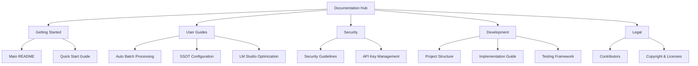

# 📚 PDFtoMD Documentation

Welcome to the comprehensive documentation for **PDFtoMD** - an enterprise-ready PDF to Markdown conversion tool with AI-powered processing and secure configuration management.

## 🗺️ Documentation Navigation

### 🚀 Getting Started

| Document | Purpose | Audience |
|---|---|---|
| [**Main README**](../README.md) | Project overview and quick setup | All users |
| [**Quick Start Guide**](guides/QUICK_START.md) | 30-second setup for batch processing | New users |

### 📖 User Guides

| Guide | Focus Area | Use Case |
|---|---|---|
| [**Auto Batch Processing**](guides/AUTO_BATCH_GUIDE.md) | Automated PDF conversion with 50% cost savings | Production workflows |
| [**SSOT Configuration**](guides/SSOT_GUIDE.md) | Centralized configuration and API key management | Setup & security |
| [**LM Studio Optimization**](guides/LM_Studio_Optimization_Guide.md) | Local AI model optimization | Cost reduction |

### 🔒 Security & Compliance

| Document | Coverage | Critical For |
|---|---|---|
| [**Security Guide**](../.github/SECURITY.md) | Complete security framework | Enterprise deployment |

### 🛠️ Development & Technical

| Resource | Content | Target Audience |
|---|---|---|
| [**Project Structure**](development/PROJECT_STRUCTURE.md) | Complete codebase organization | Developers |
| [**Implementation Guide**](development/IMPLEMENTATION.md) | Technical implementation details | Contributors |
| [**Workspace Linting**](development/WORKSPACE_LINTING.md) | Code quality and formatting | Developers |

### ⚖️ Legal & Attribution

| Document | Purpose | Contains |
|---|---|---|
| [**Contributors**](legal/CONTRIBUTORS.md) | Project contributors and attributions | Recognition |
| [**Copyright**](legal/COPYRIGHT) | Copyright and licensing information | Legal notices |

## 🌟 Featured Documentation

### 🏃‍♂️ Quick Access Links

- **For New Users:**
  - 🚀 [30-Second Setup](guides/QUICK_START.md) - Get started immediately
  - 🔧 [Configuration Guide](guides/SSOT_GUIDE.md) - Set up your API keys securely
  - 💡 [Auto Batch Processing](guides/AUTO_BATCH_GUIDE.md) - Process multiple PDFs with 50% savings

- **For Developers:**
  - 🗂️ [Project Structure](development/PROJECT_STRUCTURE.md) - Understand the codebase
  - 🔒 [Security Framework](../.github/SECURITY.md) - Implement secure practices
  - 🧪 [Testing Guide](../test_comprehensive.py) - Run comprehensive tests

- **For Enterprise:**
  - 🛡️ [Security Compliance](../.github/SECURITY.md) - Enterprise security requirements
  - 👥 [Team Setup](guides/SSOT_GUIDE.md) - Multi-user configuration
  - 📊 [Cost Management](guides/AUTO_BATCH_GUIDE.md) - Budget controls

## 📋 Documentation Standards

This documentation follows enterprise standards:

- ✅ **Comprehensive Coverage** - All features documented
- ✅ **Visual Diagrams** - Mermaid flowcharts and architecture diagrams
- ✅ **Up-to-Date** - Reflects current codebase state
- ✅ **Cross-Referenced** - Internal links verified
- ✅ **Multi-Audience** - Content for users, developers, and enterprise
- ✅ **Security-First** - Security considerations throughout

## 🔄 Changelog & Updates

- **Latest Version**: 4.1.0 (July 17, 2025)
- **Major Updates**: [See Changelog](CHANGELOG.md)
- **Release Notes**: [v4.1.0 Details](../RELEASE_NOTES_v4.1.0.md)

- **Security Status**: [Security Guide](../.github/SECURITY.md)

## 🤝 Contributing to Documentation

Found an issue or want to improve our docs?

1. 📝 [Create an issue](https://github.com/ch0t4nk/PDFtoMD/issues)
2. 🔄 Submit a pull request
3. 📚 Follow our [contribution guidelines](../README.md)

---

**📍 You are here:** `/docs/` → Use the navigation above to find exactly what you need!
