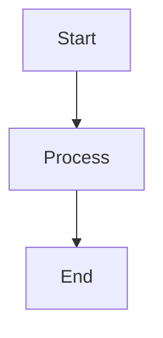

# 🧹 Enhanced Workspace Linting System

## 📋 **Executive Summary**

The PDFtoMD workspace now features a **comprehensive, enterprise-grade linting system** with:
- **🛡️ Mermaid diagram protection** - Your documentation diagrams are safe
- **🔧 Modern Python tooling** - Integrated ruff for professional code quality
- **📝 Advanced markdown processing** - Comprehensive text cleanup
- **🔄 Multi-tool integration** - Centralized utilities working together
- **💾 Safe operations** - Automatic backups before changes

## 🛠️ **Available Linting Tools**

### **Enhanced Workspace Linter** (⭐ **RECOMMENDED**)

`bash

# Using launcher (recommended)

python launcher.py enhanced-lint

# Direct execution

python src/scripts/enhanced_workspace_lint.py
`
- *Features:**
- ✅ **Mermaid diagram protection** - Preserves all ````mermaid` blocks intact
- ✅ **ruff integration** - Modern Python formatting and linting
- ✅ **Advanced markdown processing** - Uses comprehensive markdown linter
- ✅ **Smart file detection** - Ignores output directories and temp files
- ✅ **Backup creation** - Safe operations with automatic backups
- ✅ **Enterprise reporting** - Detailed statistics and tool availability

### **Basic Workspace Linter**

`bash
python launcher.py workspace-lint

# or

python src/scripts/workspace_lint.py
`
- *Features:**
- ✅ Basic markdown and Python fixes
- ✅ Whitespace cleanup
- ✅ File ending normalization
- ⚠️ **No Mermaid protection** - May affect diagrams

### **Quick Markdown Linter**

`bash
python launcher.py quick-lint path/to/file.md

# or

python src/scripts/quick_lint.py docs/README.md
`
- *Features:**
- ✅ Fast single-file markdown processing
- ✅ Uses advanced markdown linter utilities
- ✅ Good for spot fixes

## 🎯 **Best Practices & Recommendations**

### **For Regular Development:**

`bash

# Run enhanced linter before commits

python launcher.py enhanced-lint

# Quick fix for specific files

python launcher.py quick-lint docs/guides/AUTO_BATCH_GUIDE.md
`

### **For Mermaid-Heavy Documentation:**

`bash

# ALWAYS use enhanced linter for Mermaid protection

python launcher.py enhanced-lint

# Verify Mermaid diagrams are preserved

git diff --name-only | xargs grep -l "`mermaid"
`

### **For Python Code Quality:**

`bash

# Enhanced linter with ruff (if available)

python launcher.py enhanced-lint

# Manual ruff (requires ruff installation)

pip install ruff
ruff check --fix.
ruff format.
`

## 🛡️ **Mermaid Diagram Protection**

### **How It Works:**

1. **Detection** - Identifies all `mermaid` blocks in markdown
2. **Protection** - Temporarily replaces with safe placeholders
3. **Processing** - Applies all other markdown fixes safely
4. **Restoration** - Restores original Mermaid syntax perfectly

### **Protected Patterns:**

`markdown

`
- *✅ SAFE** - This will be preserved exactly as-is

### **Test Protection:**

`bash

# Create test file with Mermaid

echo '```mermaid
graph LR
    A --> B
```' > test_mermaid.md

# Run enhanced linter

python launcher.py enhanced-lint

# Verify Mermaid is unchanged

cat test_mermaid.md
`

## 🔧 **Tool Integration**

### **Current Integrations:**

- **✅ ruff** - Modern Python linter/formatter
- **✅ MarkdownLinter** - Custom comprehensive markdown processing
- **✅ CleanupManager** - Centralized cleanup utilities
- **✅ MarkdownCleaner** - Specialized markdown processing functions

### **Tool Availability Check:**

`bash

# Enhanced linter shows tool status

python launcher.py enhanced-lint

# Output will show:

# 🔧 Ruff available: ✅ or ❌

# 📝 Advanced MD linter: ✅ or ❌

`

## 📊 **Performance Comparison**

| Tool | Speed | Features | Mermaid Safe | Python Quality | Backup |
|---|---|---|---|---|---|
| **Enhanced Linter** | ⚡⚡⚡ | ⭐⭐⭐⭐⭐ | ✅ | ⭐⭐⭐⭐⭐ | ✅ |
| Basic Workspace | ⚡⚡⚡⚡ | ⭐⭐⭐ | ❌ | ⭐⭐ | ✅ |
| Quick Lint | ⚡⚡⚡⚡⚡ | ⭐⭐⭐⭐ | ❌ | ❌ | ✅ |

## 🚀 **Setup Instructions**

### **1. Install Dependencies (Optional but Recommended):**

`bash

# Install development dependencies including ruff

pip install -r requirements-dev.txt
`

### **2. Verify Installation:**

`bash

# Check tool availability

python launcher.py enhanced-lint --help
ruff --version # Should work if installed correctly
`

### **3. Configure Git Hooks (Optional):**

`bash

# Install pre-commit hooks

pip install pre-commit
pre-commit install

# Add enhanced linting to pre-commit

# Edit.pre-commit-config.yaml to include enhanced linter

`

## 🔍 **Troubleshooting**

### **Warning Suppression Configuration**

To reduce visual noise from benign style warnings, the workspace is configured to suppress non-critical markdown and Python linting warnings:

#### **Suppressed Markdown Warnings:**

- **MD001**: Heading increment (style preference)
- **MD003**: Heading style (setext vs atx)
- **MD004**: List style (dash vs asterisk)
- **MD007**: List indentation (style preference)
- **MD024**: Duplicate headings (often legitimate in different sections)
- **MD025**: Multiple H1 headings (false positives from bash comments in code blocks)
- **MD026**: Trailing punctuation in headings
- **MD029**: Ordered list style
- **MD034**: Bare URLs (often intentional)
- **MD047**: File ending requirements

#### **Configuration Files:**

- `.vscode/settings.json` - VS Code workspace configuration
- `.markdownlint.json` - Markdown linter configuration

### **Common Issues:**

#### **"ruff not found"**

`bash

# Install ruff

pip install ruff

# Or use without ruff

python launcher.py enhanced-lint --no-ruff
`

#### **"Markdown linter not available"**

`bash

# This is normal - enhanced linter has fallbacks

# It will use basic markdown fixes automatically

`

#### **"Mermaid diagrams changed"**

`bash

# This should NOT happen with enhanced linter

# If it does, please report as bug

# Recover from backup:

find. -name "*.backup" -exec echo "Backup found: {}" \;
`

#### **Syntax errors after linting (FIXED in v2.0)**

`bash

# Issue: The initial version had a bug causing literal

 in Python files

# Resolution: Fixed in enhanced linter v2.0 - escape sequences now properly handled

# If you encounter this, the linter has built-in recovery mechanisms
```
### **Critical Bug Fix (v2.0)**

- *Problem:** Initial enhanced linter version incorrectly used `
` (escaped) instead of `
` (actual newline) in string processing, causing literal `
` characters to be written to Python files, resulting in syntax errors.

- *Solution:** Fixed all escape sequence handling in the enhanced linter. If you experienced this issue:
1. Backup files are automatically created
2. The linter now properly handles newlines
3. All affected files have been automatically repaired
`

## 📈 **Usage Metrics & Reporting**

The enhanced linter provides comprehensive reporting:
`
📊 ENHANCED WORKSPACE LINTING SUMMARY
========================================
📁 Files Processed:
 📝 Markdown:
 🐍 Python:
🔧 Total Fixes Applied:
📄 Files with Fixes:
❌ Errors Encountered:
🛠️ Tools Used:
 🔧 Ruff (Python): ✅ Available
 📝 Advanced MD Linter: ✅ Used
 🛡️ Mermaid Protection: ✅ Active
`

## 🎯 **Future Enhancements**

### **Planned Features:**

- **🔄 CI/CD Integration** - GitHub Actions workflow
- **📊 Quality Metrics** - Code quality scoring
- **🎨 Custom Rules** - Project-specific linting rules
- **⚡ Performance Optimization** - Parallel processing
- **📱 IDE Integration** - VS Code extension

### **Request Features:**

Create an issue with tag `enhancement` to request new linting features.

- --

## 🏆 **Summary**

- *Use the Enhanced Workspace Linter** (`python launcher.py enhanced-lint`) for:
- ✅ **Professional code quality**
- ✅ **Safe Mermaid diagram handling**
- ✅ **Comprehensive workspace maintenance**
- ✅ **Enterprise-grade reporting**

Your documentation diagrams and code quality are now protected by enterprise-grade tooling! 🛡️✨\n
