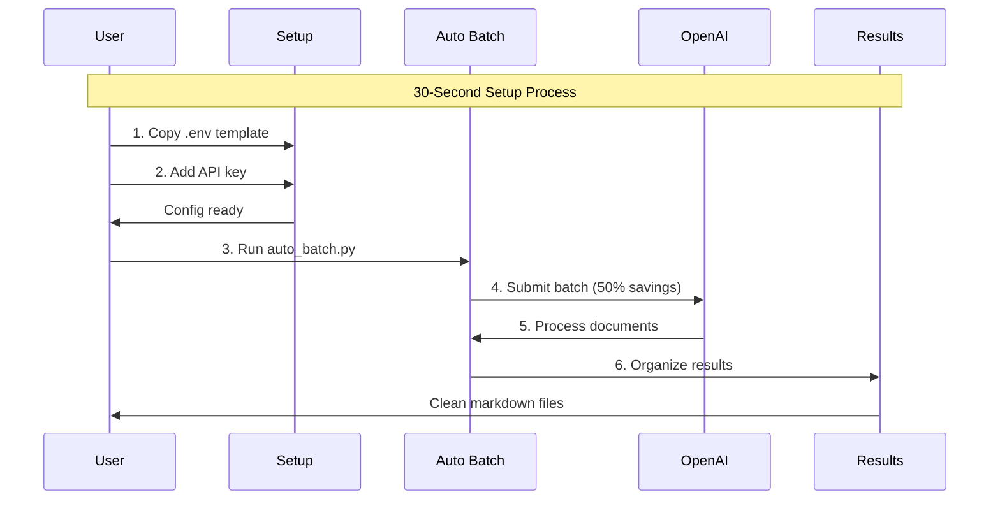
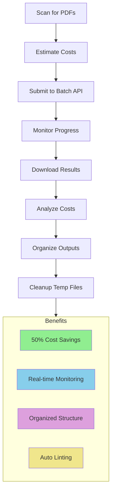
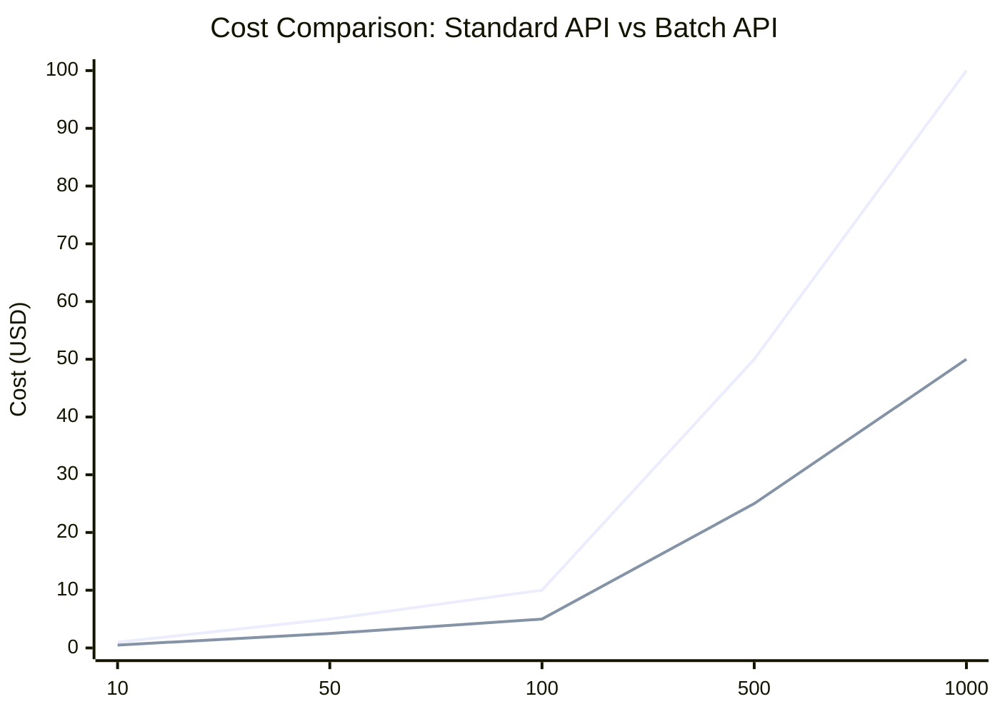
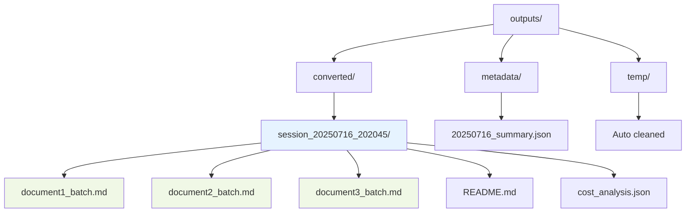

# 🚀 Quick Start Guide - Auto Batch Processing


## TL;DR - 30 Second Setup

| Step | Command | Description |
|---|---|---|
| 1 | `cp.env.template.env` | Create config file |
| 2 | Edit `.env` file | Add API key: `OPENAI_API_KEY="sk-..."` |
| 3 | `python config.py` | Test configuration |
| 4 | `python src/batch/auto_batch.py` | Start processing! |

- *🎉 Result:** 50% cost savings, automated monitoring, organized outputs in timestamped folders.

- --

## What Happens Automatically


**🤖 AUTO BATCH PROCESSING WORKFLOW**
1. 🔍 **Scan for PDFs** - Finds all.pdf files in input folder
2. 📊 **Estimate costs** - Shows cost breakdown before processing
3. 🚀 **Submit to OpenAI Batch API** - 50% cheaper than standard API
4. ⏰ **Monitor progress** - Automatic status checks with live updates
5. 📥 **Download results** - All files converted to clean markdown
6. 💰 **Analyze costs** - Detailed financial breakdown and analytics
7. 📁 **Organize outputs** - Creates timestamped session folders
8. 🧹 **Cleanup** - Removes temporary files automatically

## Example Run
```bash
$ python auto_batch.py
🚀 AUTOMATED BATCH PDF PROCESSING
📁 Input Folder: pdfs
📁 Output Folder: converted_markdown
🆔 Session ID: 20250715_202045

⏰ Step 1: Scanning for PDFs in pdfs
✅ Found 7 PDF files (3.0 MB total)

⏰ Step 2: Setting up workspace
✅ Workspace ready: converted_markdown\session_20250715_202045

⏰ Step 3: Estimating processing costs
📊 Estimated Cost: ~$0.47 (93 pages)

⏰ Step 4: Submitting batch to OpenAI
✅ Batch submitted: batch_6876f077... (93 requests)

⏰ Step 5: Monitoring batch
🔄 Check #1: validating (0/93 - 0.0%)
🔄 Check #4: in_progress (49/93 - 52.7%)
🔄 Check #7: completed (93/93 - 100.0%)
✅ Batch completed in 3.0 minutes!

⏰ Step 6: Retrieving results
✅ Created 7 markdown files

⏰ Step 7: Analyzing costs
💰 Total Cost: $0.4676 ($0.005/page)

⏰ Step 8: Organizing outputs
✅ Session organized: converted_markdown\session_20250715_202045

🎉 PROCESSING COMPLETE!
📁 Results: converted_markdown\session_20250715_202045
```

## Cost Savings Comparison


| Pages | Standard API | **Batch API** | **Savings** |
|---|---|---|---|
| 10 | $0.10 | **$0.05** | **$0.05 (50%)** |
| 50 | $0.50 | **$0.25** | **$0.25 (50%)** |
| 100 | $1.00 | **$0.50** | **$0.50 (50%)** |
| 500 | $5.00 | **$2.50** | **$2.50 (50%)** |
| 1000 | $10.00 | **$5.00** | **$5.00 (50%)** |

> 💡 **Pro Tip:** The more documents you process, the more you save!

## Output Structure


**🗂️ Organized File Structure:**
```
outputs/
├── converted/
│ └── session_20250716_202045/
│ ├── document1_batch.md # Clean markdown output
│ ├── document2_batch.md # Formatted and linted
│ ├── document3_batch.md # Ready to use
│ ├── README.md # Session summary
│ └── cost_analysis.json # Detailed cost breakdown
├── metadata/
│ └── 20250716_summary.json # Daily processing summary
└── temp/ # Automatically cleaned up
```
## Configuration (Optional)

All settings are managed through the SSOT configuration system in `config.py`:
```python
# Configuration is automatically loaded from.env

# To customize, edit.env file:

# API Configuration

OPENAI_API_KEY="sk-your-key"
OPENAI_API_BASE="https://api.openai.com/v1"
OPENAI_DEFAULT_MODEL="gpt-4o-mini"

# Directory Settings

PDF_FOLDER="pdfs"
OUTPUT_FOLDER="outputs"
TEMP_FOLDER="temp"

# Processing Settings

TEMPERATURE=0.05
MAX_TOKENS=8192

# Cost Controls

COST_WARNING_THRESHOLD=1.0
COST_ALERT_THRESHOLD=5.0
```
## Troubleshooting

| Problem | Solution |
|---|---|
| "No PDFs found" | Put PDFs in `pdfs/` folder |
| "API key not set" | Run `python config.py` to check, edit `.env` file |
| "Configuration error" | Copy `.env.template` to `.env` and configure |
| "Insufficient quota" | Check OpenAI billing dashboard |
| "Batch failed" | Check internet connection, try again |

## Next Steps

- 📖 Read the [SSOT Configuration Guide](SSOT_GUIDE.md) for detailed setup
- 📖 Read the [complete batch guide](AUTO_BATCH_GUIDE.md) for advanced features
- ⚙️ Customize settings in `.env` file
- 📊 Check cost analysis in the outputs/metadata/ folder
- 🔄 Run `python monitor_batch.py batch_id` for live monitoring

- --

- *Happy batch processing!** 🚀 For questions, see the [main README](../../README.md) or [detailed guide](AUTO_BATCH_GUIDE.md).
